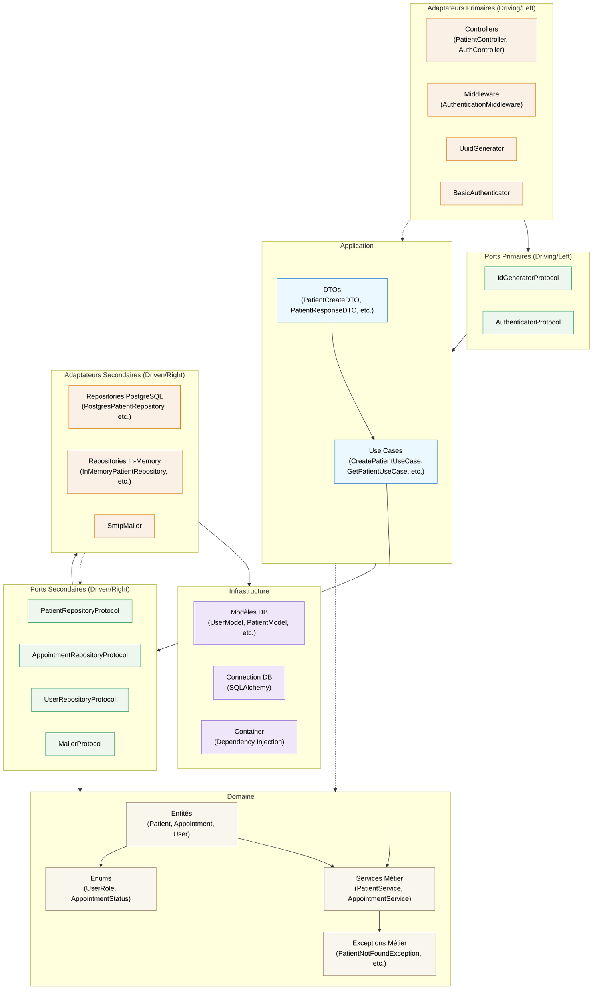

Le diagramme ci-dessus illustre l'architecture hexagonale (également appelée architecture ports et adaptateurs) utilisée dans le backend MediSecure. Voici une explication détaillée des différentes couches:

### Structure Hexagonale

1. **Couche Domaine (Cœur)** - Le centre de l'hexagone:
   - **Entités**: Patient, Appointment, User - objets de valeur fondamentaux avec leur logique métier
   - **Services métier**: PatientService, AppointmentService - implémentent les règles métier complexes
   - **Exceptions métier**: PatientNotFoundException, etc. - exceptions spécifiques au domaine
   - **Enums**: UserRole, AppointmentStatus - types énumérés du domaine

2. **Couche Application**:
   - **Use Cases**: CreatePatientUseCase, GetPatientUseCase, etc. - orchestrent les opérations du domaine
   - **DTOs**: PatientCreateDTO, PatientResponseDTO - objets de transfert de données

3. **Ports** - Interfaces qui définissent comment les adaptateurs interagissent avec le domaine:
   - **Ports Primaires** (driving/left side): IdGeneratorProtocol, AuthenticatorProtocol
   - **Ports Secondaires** (driven/right side): PatientRepositoryProtocol, UserRepositoryProtocol, etc.

4. **Adaptateurs** - Implémentations concrètes qui connectent le système aux technologies externes:
   - **Adaptateurs Primaires**: Controllers, Middleware, UuidGenerator
   - **Adaptateurs Secondaires**: PostgresRepositories, InMemoryRepositories, SmtpMailer

5. **Infrastructure**:
   - Modèles de base de données (UserModel, PatientModel)
   - Connection DB via SQLAlchemy
   - Container pour l'injection de dépendances

### Avantages de cette architecture

- **Isolation du domaine**: Le code métier est protégé des détails techniques
- **Testabilité**: Facilité de tester en remplaçant les adaptateurs (ex: repositories in-memory pour les tests)
- **Flexibilité**: Les adaptateurs externes peuvent être changés sans affecter le domaine
- **Indépendance des frameworks**: Le domaine ne dépend d'aucun framework
