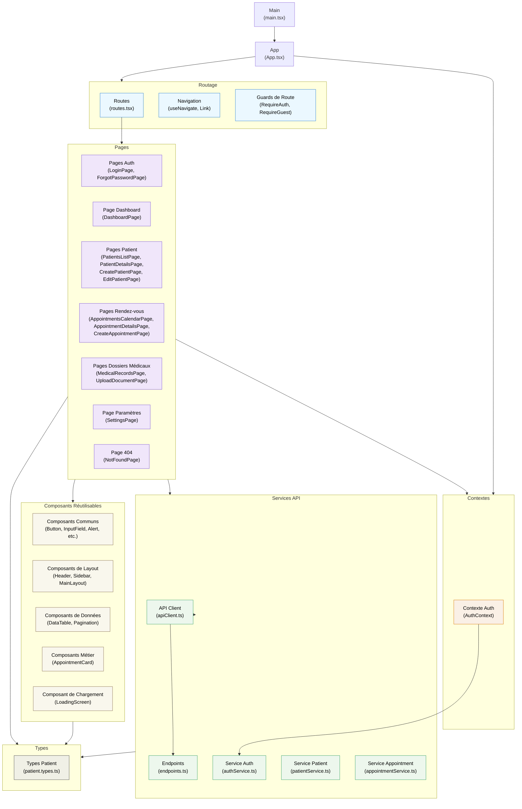

### Architecture du Frontend MediSecure

Le frontend est construit avec React et TypeScript, suivant une architecture modulaire et orientée composants. Voici la décomposition de cette architecture:

#### 1. Structure de Base
- **App (App.tsx)**: Point d'entrée principal de l'application
- **Main (main.tsx)**: Initialisation de l'application React et rendu dans le DOM

#### 2. Composants Réutilisables
Ces composants forment la bibliothèque UI de l'application:
- **Composants Communs**: Button, InputField, Alert, SelectField - éléments UI de base réutilisables
- **Composants de Layout**: Header, Sidebar, MainLayout - gèrent la structure visuelle de l'application
- **Composants de Données**: DataTable, Pagination - pour l'affichage des listes et tableaux de données
- **Composants Métier**: AppointmentCard - composants spécifiques au domaine métier
- **Composant de Chargement**: LoadingScreen - feedback utilisateur pendant les opérations asynchrones

#### 3. Routage
Gère la navigation et les protections d'accès:
- **Routes (routes.tsx)**: Définition de toutes les routes de l'application
- **Navigation**: Hooks et composants (useNavigate, Link) pour la navigation
- **Guards de Route**: RequireAuth et RequireGuest - protections d'accès aux pages

#### 4. Services API
Encapsule la communication avec le backend:
- **API Client (apiClient.ts)**: Client HTTP avec intercepteurs pour la gestion des tokens
- **Endpoints (endpoints.ts)**: Points d'entrée API centralisés
- **Services Spécifiques**: authService, patientService, appointmentService - abstraction des appels API pour chaque domaine

#### 5. Contextes
État global de l'application:
- **AuthContext**: Gestion de l'authentification et des informations utilisateur au niveau global

#### 6. Pages
Composants de plus haut niveau représentant des écrans complets:
- **Pages Auth**: LoginPage, ForgotPasswordPage
- **Dashboard**: Vue d'ensemble des informations
- **Pages Patient**: Liste, détails, création et modification de patients
- **Pages Rendez-vous**: Calendrier, détails et création de rendez-vous
- **Pages Dossiers Médicaux**: Visualisation et téléchargement de documents
- **Page Paramètres**: Configuration utilisateur
- **Page 404**: Gestion des routes inconnues

#### 7. Types
Interfaces TypeScript pour la vérification de type:
- **Types Patient**: Définitions des interfaces pour les patients

### Caractéristiques Architecturales

Cette architecture présente plusieurs avantages:

1. **Séparation des Préoccupations**: Chaque partie du code a une responsabilité claire
2. **Réutilisation**: Les composants UI communs sont partagés dans toute l'application
3. **Modularité**: Organisation en modules fonctionnels facilement maintenables
4. **Gestion d'État**: Utilisation de contextes React pour l'état global
5. **Consistance UI**: Composants standardisés pour une expérience utilisateur cohérente
6. **Protection des Routes**: Sécurisation de l'accès aux différentes parties de l'application
7. **Services Abstraits**: La logique API est encapsulée dans des services dédiés